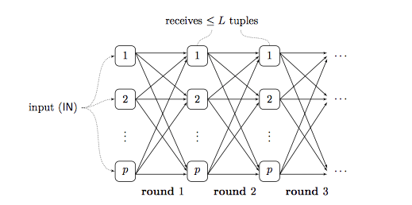

algorithmic aspects of parallel data processing
===============================================

Tags: Product

现代的数据分析通常是跑在大规模的 shared-nothing 集群上。

join的性能是大数据处理系统里面一个最重要的指标。两种join方法，hash join
和 sort join。hash
join在大多数的数据集中都可以通过增加设备来做到线性扩展。但是当数据倾斜比较严重时，hash
join 性能就会比较差，比如大多数

都被hash到同一个节点上。sort join
对于数据倾斜这种情况反而能处理的很好，但是在排序又带来额额外的消耗。

MPC
---

MPC 是一个拿来分析数据交换代价的模型。BSP 模型属于MPC
里比较有代表性的一个。BSP 模型只关心数据交换的成本，忽略计算成本。BSP
通常被抽象成 shared-nothing 架构，并且在很多大数据处理系统中应用很广泛。

如下图所示，我们有一个集群，集群中还有 p
个实例节点。每个独立的节点都有自己的处理器跟内存。在这里面我们可以用处理器来代替集群中的实例或者是服务器。这
p 个处理器通过网络后者是 channels
连接到一起，每一个处理器都可以从其他的任意处理器上面接收数据，或者发送数据到其他任意处理器上面。

|image0|

计算过程可以抽象成 ``steps`` 或者是 ``rounds``\ ，每一个 ``round``
包含两个独立的步骤：

1. 计算单元：处理器计算当前节点的数据
2. 数据交换单元：处理单元之间，通过发送和接收来交换数据。

输入的数据 ``input`` 会被初始化，然后切分成不同的 partition 分给这 p
个处理单元。我们用 ``IN`` 来表示输入数据的规模，没有什么特殊情况的话，
``IN`` 就是这个数据数据的条数，或者是 ``bits`` 大小。把 ``input``
的数据切分成不同的 ``partition``
并没有什么确切的方法，怎么切分不重要，重要的是在计算单元能够正确的处理被分配到当前节点的数据。计算结束后，我们需要保证
``output data`` 都保存在这 p
个处理单元的内存里面。相比与让同一个节点持有所有的 ``result``\ ，
这个要求要低一些，但是在并行的数据处理系统中， ``output``
有的时候甚至会比 ``input`` 更大，分布式的保存在 p
个处理单元上是必要的。在这里我们用 ``OUT`` 来表示 ``output data``
的规模大小。

我们对处理单元的计算性能，或者是节点之间数据的交换方式没有特别的要求，这个模型只关注几个参数：处理单元的个数，rounds
的次数，以及数据交换成本。

MPC 模型的参数
--------------

-  处理单元个数 p

处理单元个数 p 意味着有 p 个资源并行处理数据，理论上讲 p
值越大，处理速度就越快。拿 MapReduce 来举例的话，p 等价于最多有多少个的
mapper ，也等价于最多有多少个 reducer。

-  rounds 个数 r

r
代表了这个算法需要跑多少轮之后才能结束，处理单元之间需要进行多少次数据同步。每一次
round，都是以最慢的那个 ``processor`` 为准，所以随着 ``r``
的增加，处理时间，也会随着增加。我们在设计算法的时候， ``r`` 越小约好。

-  负载/数据交换成本 L

MPC 模型中最重要的就是数据交换成本。我们用任意一个 ``p`` 上面的任意一组
``r`` 中 ``size`` 最大的那组数据来表示
``L``\ 。如果要统计整过计算过程中的数据交换成本，就需要把所有
``processor`` 的所有 ``round`` 的数据量都累加起来。

最大负载定义如下

.. math:: L\stackrel {def} {=} \max_{u=1}^p \max_{k=1}^r L_{u}^{(k)}

总的负载定义如下：

.. math:: C\stackrel{def} {=} \sum_{u=1}^{p} \sum_{k=1}^{r} L_{u}^{(k)}

需要注意的是，总输入的数据规模 ``IN`` 肯定是不大于 ``C``\ ，而 ``C``
不大于 ``r*p*L``\ ，也就是

``IN ≤ C ≤ r*p*L``

输入数据 ``input`` 在第 ``0`` 轮 ``round``
也就是在初始化的时候，会平均分给所有的 ``processor`` ，所以从每一个
processor 都可以在初始化的时候都可以被表示为

.. math:: L_{u}^{(0)} \stackrel{def} {=} IN/p

MPC 模型下一个算法的负载，主要是受限于 ``input`` 数据的规模大小，
``processor`` 数量，以及 ``rounds`` 数量。

MPC 模型通常由两种实现，一个是 ``stateless`` MPC 模型，每个
``processor``\ 上的数据在当前这一个 round 结束的时候，都会被清除。每一个
round 开始的时候，这些 ``processor`` 只含有当前 round
接受的数据。还有一个是 ``stateful`` MPC 模型， 这个模型中，
``processor`` 上内存里面的 ``state`` 会被保留到下一轮，而 ``stateless``
模型下， ``processor`` 则是通过对自己发送或者接收数据来维护这个
``state`` 。 总的来说，每个含有 ``r`` 轮负载为 ``L`` 的 ``stateful`` MPC
算法可以被一个 含有 ``r`` 轮，负载为 ``L'=r*L`` 的 stateless MPC
算法来代替。在 ``stateless`` 的 MPC
模型中，每一轮计算中，都可以产生最终结果的一部分。而在 ``stateful`` 的
MPC 模型中，最终结果则通常在最后一轮 ``round`` 中产生，而不会在过程中的
``rounds`` 里。

实际上我们设计 MPC
算法的时候，最关注的点就是尽可能的减少运行时间。总的运行时间跟两个单元组成，1）每个节点上的处理时间，这个取决于负载
``L``
、这个节点上运行的算法以及这个节点的处理器性能。2）一共需要处理多少轮
``r`` 。而我们更多的假设 ``r=1`` 或者是不限制 ``r`` 有多少轮，然后只对
``L`` 做优化，因为 ``r`` 的大小取决于 ``input``
输入的数据多少，以及集群中有多少 ``processor`` ，可以优化的空间有限。

Speedup and scaleup
-------------------

MPC是被作为 ``shared-nothing`` 架构的一种抽象而被设计出来的。而
``speedup`` 和 ``scaleup`` 是 ``shared-nothing``
系统的两个基本的参数。对于固定的数据 ``input`` ， ``speedup``
简单来说，当我们增加 ``processor``
数量的时候，处理数据的速度也要随之线性的增加。如果我们把 ``processors``
的个数 ``p`` 直接 ``*2``\ ，那处理数据的速度也应该 ``*2``
，但是实际系统中， ``speedup`` 都不会线性的增长。 ``scaleup`` 是当
``input`` 数据增加的时候，我们可以通过增加 ``processors``
的数量来保持性能。比如当 ``input`` 的数据量 ``*2``
的时候，我们可以通过增加一倍的 ``processor``
个数来保证系统的性能。理论情况的的最优状况 ``scaleup``
也是线性的，但是实际情况下这个也做不到。

MPC模型中，不管是 ``speedup`` 还是 ``scaleup`` ，都严重依赖于负载 ``L``
以及每个节点上算法的运行时间。我们假定 ``r`` 是一个固定的数值，输入为
``IN`` ， ``processor`` 个数为 ``p`` ，节点上的负责 L 则为 ``L(IN,p)``
。为了简化问题，我们不考虑每个节点上面处理数据的计算时间，直接用
``Time=O(L)`` 来表示每个 ``processor``
上面的处理时间。在上面几种假设下， ``speedup`` 的公式为
``f(p) = L(IN, 1)/L(IN, p) = c/L(IN, p)`` ， ``scaleup`` 的公式为
``g(t) = L(IN, p)/L(IN*t, t*p) = c'/L(IN*t, p*t)``
。大多数的算法的负载为 :

.. math:: L=O(IN/p^{\delta})

且0 < 𝛿 ≤ 1。

